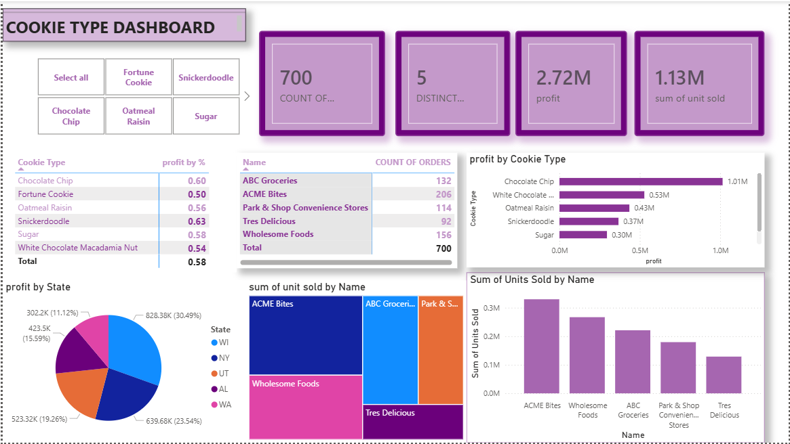

# Cookie Type Sales Dashboard

**Interactive Power BI dashboard** providing clear insights into cookie sales performance, profitability, and customer trends.

## 📊 Business Overview

- **Total Orders**: 700  
- **Total Profit**: $2.72M  
- **Total Units Sold**: 1.13M  
- **Distinct Customers**: 5

## 🎯 Key Insights

- **Chocolate Chip** is the top performer, generating **$1.01M** in profit.
- **Wisconsin (WI)** leads in profitability with **30.49%** of total profit.
- Strong performance from key customers, particularly **ACME Bites**.
- Overall profit margin across all cookie types: **58%**.

## 📈 Dashboard Features

- Filter by Cookie Type (Chocolate Chip, Fortune Cookie, Snickerdoodle, Oatmeal Raisin, Sugar, White Chocolate Macadamia Nut)
- Profit analysis by cookie type and state
- Order volume and units sold by customer
- Interactive cross-filtering for quick insights

## 🛠️ Technology

- Built with **Power BI Desktop**

## Dashboard Preview

## 🚀 How to Use

1. Open `Cookie Type Sales Dashboard.pbix` in Power BI
2. Use the cookie type slicers to filter results
3. Click on any visual to explore cross-filtered data

---
 ## Author
 Eze Chinweotito
